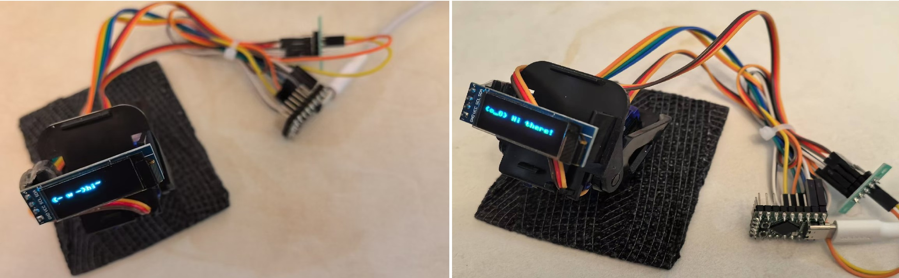
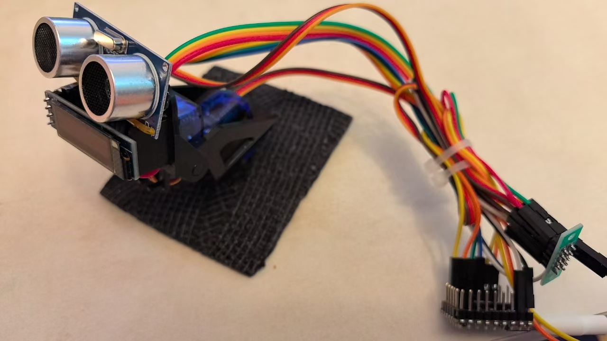
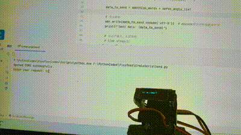
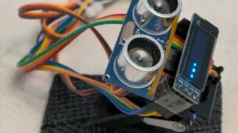

# Simple Desktop Pet Based on Raspberry Pi Pico

> **Note**: This project is under construction, which may lead to inconsistencies between the documents and the code. Feel free to submit an ISSUE. The author might slack off anytime, but contributions (push requests) are always welcome.

This project demonstrates how to use a Raspberry Pi Pico and some basic hardware components to build a simple desktop pet. It aims to provide a beginner-friendly guide for hardware programming and embedded systems development through this Raspberry Pi Pico desktop pet.

The **minimum development cost** of this project is about 50 RMB. For example:

- By connecting to a computer via a UWB port, entering information will display emoticons on the screen along with some actions.

- You can also connect a **perception device**, like a radar ranging tool (additional cost: ~3 RMB), to sense surroundings and provide feedback to the computer. This will, however, make the code logic more complex. Both versions—**with radar** and **without radar**—are explained. Beginners can start with the radar-free version.

When the radar is not loaded, interaction is only possible via the computer. With radar, you can interact based on hand movements, as shown in these examples:

  

Refer to the documentation in the `docs` directory for installation details. If you encounter issues, check the "install-tips" guide (it’s highly recommended to read the notes before proceeding with wiring and servo installation!).

---

## Quick Start

1. Navigate to the `docs` directory.
2. Review the project documentation to get started.

---

## Project File Structure

The project directory structure is as follows. Each folder contains a `README.md` file with more details.

- **Codes**: Stores project code.
  - **LowerMachine**: Code for the lower-level hardware (Raspberry Pi Pico).
  - **UpperMachine**: Code for the upper-level hardware (computer).
- **Docs**: Stores project documentation.

---

## Contribution

- Interested in participating? Check the [Issue]() section for unassigned tasks.
- Found an issue? Report it via [Issue]() 🐛.
- Want to get involved? Join the discussion in [Discussion]() 💬.

If you're interested in Datawhale and want to initiate a new project, refer to the [Datawhale Contribution Guidelines](https://github.com/datawhalechina/DOPMC#%E4%B8%BA-datawhale-%E5%81%9A%E5%87%BA%E8%B4%A1%E7%8C%AE).

---

## List of Contributors

| Name          | Role              | Introduction                          |
| :------------ | :---------------- | :------------------------------------ |
| **Liyulingyue** | Project Lead      | A developer who specializes in procrastination |

---

## Stay Connected

Scan the QR code below to follow the Datawhale public account:

